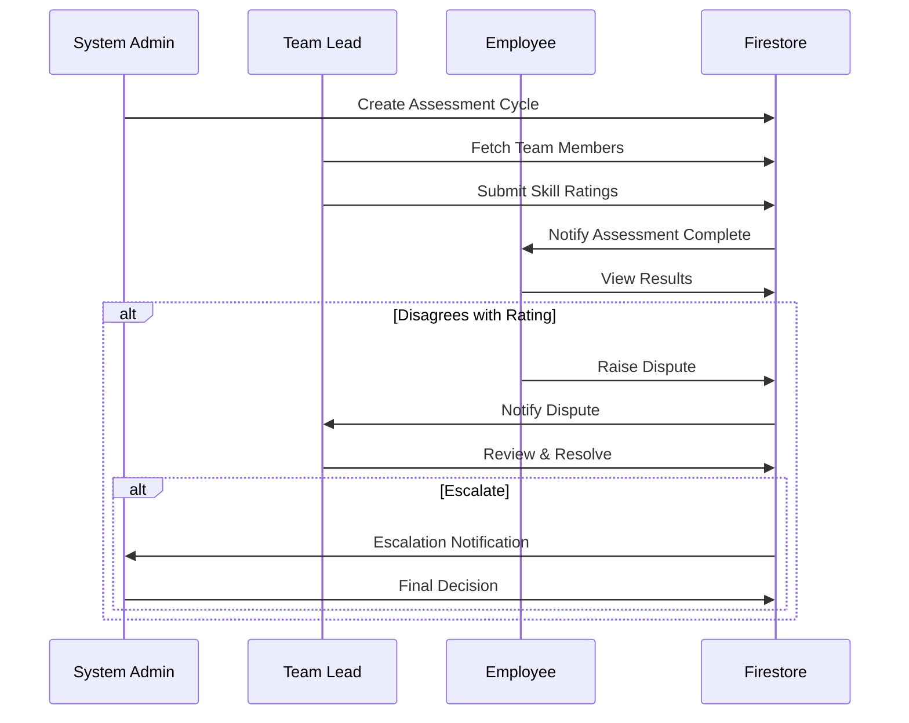

# thinkathon
threemovesahead

# 🎯 SkillBridge - Intelligent Skill Management Platform


> **Transform chaotic skill management into an intelligent, automated system**

SkillBridge is a comprehensive role-based skill management platform that automates the entire employee skill lifecycle - from assessment to training to growth tracking. Built for organizations that value transparency, fairness, and data-driven decision making.

---

## 📋 Table of Contents

- [Features](#-features)
- [Architecture](#-architecture)
- [Technology Stack](#-technology-stack)
- [Getting Started](#-getting-started)
- [User Roles](#-user-roles)
- [Key Workflows](#-key-workflows)
- [API Documentation](#-api-documentation)
- [Deployment](#-deployment)
- [Contact](#-contact)

---

## 🚀 Features

### Core Capabilities

#### 🔐 **Authentication & Authorization**
- Multi-method authentication (Email/Password, Phone, Social OAuth)
- Role-based access control (RBAC)
- Dynamic role detection (automatic Team Lead promotion)
- Session management with auto-expiry

#### 📊 **Skill Assessment Management**
- Create and manage assessment cycles
- Bulk team assessment for Team Leads
- Granular skill ratings (1-10 scale)
- Historical assessment tracking
- Assessment calendar and reminders

#### ⚖️ **Fair Dispute Resolution**
- Three-tier dispute escalation system
- Evidence-based dispute filing
- Complete audit trail
- Automated notifications
- Resolution tracking and analytics

#### 🎓 **Training Management**
- AI-driven training recommendations
- Gap-based training matching
- Training session creation and scheduling
- Enrollment management with capacity limits
- Training impact analytics

#### 📈 **Real-Time Analytics**
- Skill gap heat maps
- Assessment completion dashboards
- Training need identification (TNI)
- Training effectiveness metrics
- Dispute resolution analytics
- Department-wise skill distribution

#### 👥 **Team Management**
- Team member overview
- Skill gap identification
- Growth tracking over time
- Training impact analysis
- Performance trend visualization

---

## 🏗️ Architecture

SkillBridge follows a modern **multi-role SPA architecture** with clear separation of concerns:

```
┌─────────────────────────────────────────────────────────┐
│                   Client Layer (Browser)                 │
│  ┌──────────────┐  ┌──────────────┐  ┌──────────────┐  │
│  │   Employee   │  │  Team Lead   │  │ System Admin │  │
│  │    Portal    │  │    Portal    │  │    Portal    │  │
│  └──────────────┘  └──────────────┘  └──────────────┘  │
└──────────────────────────┬──────────────────────────────┘
                           │
                ┌──────────▼───────────┐
                │   Authentication     │
                │  & Authorization     │
                └──────────┬───────────┘
                           │
          ┌────────────────┼────────────────┐
          │                │                │
┌─────────▼────────┐ ┌────▼─────┐ ┌────────▼────────┐
│ Firebase Auth    │ │ Firestore│ │ Cloud Storage   │
└──────────────────┘ └──────────┘ └─────────────────┘
```

### Architecture Highlights

- **Frontend**: Vanilla JavaScript ES6+ with modular design
- **Styling**: Tailwind CSS for responsive, utility-first design
- **Backend**: Firebase (Authentication, Firestore, Storage)
- **Hosting**: Vercel with global CDN
- **Security**: Multi-layer security with client and server-side validation
- **Performance**: Code splitting, lazy loading, offline support

---

## 🛠️ Technology Stack

<table>
<tr>
<td>

### Frontend
- **HTML5** - Semantic markup
- **CSS3** - Modern styling
- **Tailwind CSS** - Utility-first CSS
- **JavaScript ES6+** - Modern JS features
- **Firebase SDK** - v10.12.4

</td>
<td>

### Backend
- **Firebase Authentication** - User management
- **Cloud Firestore** - NoSQL database
- **Cloud Storage** - File storage
- **Firebase Security Rules** - Access control

</td>
</tr>
<tr>
<td>

### Development Tools
- **VS Code** - IDE
- **Git** - Version control
- **npm/yarn** - Package management

</td>
<td>

### Deployment
- **Vercel** - Static hosting
- **GitHub** - Code repository
- **Firebase Console** - Backend management

</td>
</tr>
</table>

---

## 🚀 Getting Started

### Prerequisites

- **Node.js** (v14 or higher)
- **npm** or **yarn**
- **Firebase account** (free tier works)
- **Modern web browser** (Chrome, Firefox, Safari, Edge)

### Installation

1. **Clone the repository**
   ```bash
   git clone https://github.com/anuragmaldhure/thinkathon.git
   cd thinkathon
   ```

2. **Configure Firebase**
   
   Create a Firebase project at [Firebase Console](https://console.firebase.google.com/)
   
   Update `scripts/env.js` with your Firebase configuration:
   ```javascript
   export const env = {
     FIREBASE_CONFIG: {
       FIREBASE_API_KEY: 'your-api-key',
       FIREBASE_AUTH_DOMAIN: 'your-project.firebaseapp.com',
       FIREBASE_PROJECT_ID: 'your-project-id',
       FIREBASE_STORAGE_BUCKET: 'your-project.appspot.com',
       FIREBASE_MESSAGING_SENDER_ID: 'your-sender-id',
       FIREBASE_APP_ID: 'your-app-id',
       MEASUREMENT_ID: 'your-measurement-id',
       FIRESTORE_DB_NAME: 'skillbridge'
     },
     AUTH_ENABLED: true,
     BASE_URL: ''
   };
   ```

3. **Enable Firebase Authentication**
   
   In Firebase Console:
   - Go to Authentication > Sign-in method
   - Enable Email/Password
   - Enable Phone (optional)
   - Configure OAuth providers (optional)

4. **Set up Firestore Database**
   
   - Go to Firestore Database
   - Create database in production mode
   - Create collections: `users`, `employees`, `skills`, `assessments`, `training`, `disputes`
   - Deploy security rules (see [Security Rules](#security-rules))

5. **Run the development server**
   ```bash
   # Using Python
   python -m http.server 8000
   
   # OR using Node.js
   npx http-server -p 8000
   
   # OR using Live Server (VS Code extension)
   # Right-click on navigator.html > Open with Live Server
   ```

6. **Access the application**
   ```
   http://localhost:8000/navigator.html
   ```

### First-Time Setup

1. **Create your first System Admin user**
   ```javascript
   // After signing up via auth.html, manually add to Firestore:
   // Collection: users
   {
     uid: "firebase-auth-uid",
     email: "admin@example.com",
     firstName: "Admin",
     lastName: "User",
     role: "systemAdmin",
     employeeId: "EMP001",
     createdAt: new Date(),
     updatedAt: new Date()
   }
   ```

2. **Navigate to System Admin Portal** to set up:
   - Departments
   - Skills and categories
   - Skill criticalities
   - Team structure

---


## 👥 User Roles

### 🔷 System Administrator

**Access Level**: Highest  
**Primary Functions**:
- Create and manage assessment cycles
- Manage employees, departments, and skills
- Configure training sessions and assign trainers
- Review and resolve escalated disputes
- Access all analytics dashboards
- Generate organization-wide reports

**Key Pages**:
- Dashboard with KPIs
- Employee management (CRUD)
- Skills catalog management
- Assessment cycle management
- Training session scheduling
- Dispute resolution center
- 5 Analytics dashboards (TNI, Skill Gaps, Completion, Training Forecast, Dispute Metrics)

---

### 🔶 Team Lead

**Access Level**: Team-specific  
**Primary Functions**:
- Assess team members' skills
- Review team skill gaps
- Monitor training progress
- Resolve disputes from team members
- Add skills to employees
- Track team growth trends

**Key Pages**:
- Team dashboard
- My team overview
- Employee skill assessment
- Skill gap analysis
- Add/map skills to employees
- Training impact tracking
- Skill trend analysis


---

### 🔵 Employee

**Access Level**: Self-service  
**Primary Functions**:
- View personal skill profile
- Check assessment results
- Raise disputes on unfair ratings
- Enroll in training sessions
- Track skill growth over time
- View training history

**Key Pages**:
- Employee dashboard
- My skills overview
- My training sessions
- Raise dispute
- Dispute tracking
- Skill growth detail
- My profile

---

## 🔄 Key Workflows

### 1. Assessment Cycle Workflow



### 2. Training Management Workflow

1. **Gap Identification**: System Admin reviews skill gap analytics
2. **Session Creation**: Admin creates training session with target skills
3. **Trainer Assignment**: External/internal trainer assigned
4. **Employee Notification**: Eligible employees notified
5. **Enrollment**: Employees enroll (capacity-limited)
6. **Conduct Training**: Trainer marks attendance, uploads materials
7. **Completion & Feedback**: Employees rate training
8. **Impact Analysis**: Before/after skill comparison

### 3. Dispute Resolution Workflow

```
Employee Raises Dispute
        ↓
Team Lead Reviews
        ↓
    ┌───┴───┐
Accept  │  Reject  │  Escalate
    ↓       ↓         ↓
Update  Notify   System Admin
Rating  Employee  Final Decision
    ↓       ↓         ↓
   [RESOLVED]    [RESOLVED]
```


## 📚 API Documentation

### Firebase Collections

#### `users`
```javascript
{
  uid: string,              // Firebase Auth UID
  email: string,            // User email
  firstName: string,        // First name
  lastName: string,         // Last name
  role: string,             // "systemAdmin" | "employee" | "teamLead"
  employeeId: string,       // Employee reference
  departmentId: string,     // Department reference
  createdAt: timestamp,
  updatedAt: timestamp,
  lastLoginAt: timestamp
}
```

#### `employees`
```javascript
{
  id: string,               // Employee ID
  firstName: string,
  lastName: string,
  email: string,
  departmentId: string,
  teamLeadId: string,       // Reference to manager
  skills: array,            // Array of {skillId, level, lastAssessed}
  createdAt: timestamp,
  updatedAt: timestamp
}
```

#### `skills`
```javascript
{
  id: string,
  name: string,
  description: string,
  categoryId: string,
  criticalityId: string,    // "Critical" | "Important" | "Nice-to-have"
  createdAt: timestamp,
  updatedAt: timestamp
}
```

#### `assessments`
```javascript
{
  id: string,
  cycleId: string,          // Assessment cycle reference
  employeeId: string,
  assessorId: string,       // Team Lead who assessed
  ratings: array,           // [{skillId, rating, comments}]
  status: string,           // "draft" | "submitted" | "completed"
  submittedAt: timestamp,
  createdAt: timestamp
}
```

#### `training`
```javascript
{
  id: string,
  title: string,
  description: string,
  skillIds: array,          // Target skills
  trainerId: string,
  schedule: {
    startDate: timestamp,
    endDate: timestamp,
    location: string
  },
  participants: array,      // Employee IDs
  maxParticipants: number,
  status: string,           // "upcoming" | "ongoing" | "completed"
  materials: array,         // Storage URLs
  createdAt: timestamp
}
```

#### `disputes`
```javascript
{
  id: string,
  employeeId: string,
  assessmentId: string,
  skillId: string,
  currentRating: number,
  expectedRating: number,
  reason: string,
  evidence: array,          // Storage URLs
  status: string,           // "pending" | "resolved" | "rejected" | "escalated"
  teamLeadResponse: string,
  adminResponse: string,
  resolutionDate: timestamp,
  createdAt: timestamp
}
```
---

## 🚀 Deployment

### Deploying to Vercel

1. **Install Vercel CLI**
   ```bash
   npm i -g vercel
   ```

2. **Login to Vercel**
   ```bash
   vercel login
   ```

3. **Deploy**
   ```bash
   vercel --prod
   ```

4. **Configure Custom Domain** (optional)
   ```bash
   vercel domains add yourdomain.com
   ```

### Environment Configuration

Update production environment variables:
```javascript
// scripts/env.js
export const env = {
  FIREBASE_CONFIG: {
    // Use production Firebase project
  },
  AUTH_ENABLED: true,
  BASE_URL: 'https://skillbridge.vercel.app'
};
```

### Continuous Deployment

Connect GitHub repository to Vercel for automatic deployments:
1. Go to Vercel Dashboard
2. Import Git Repository
3. Configure build settings
4. Enable automatic deployments on push

---


## 📞 Contact & Support

### Team
- Susmita H - susmita.hubale@thinkbridge.in
- Saurabh S - saurabh.s@thinkbridge.in
- Anurag M - anurag.m@thinkbridge.in

---
